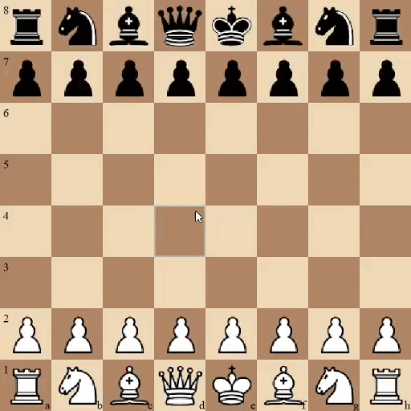

# ♟ Python Chess


## Gameplay Preview




A clean and functional **chess game built with Python and Pygame**.
The project focuses on **accurate chess rules, clean architecture, and a polished GUI**.

The codebase separates **game logic** and **graphical interface**, making the project easier to understand and extend.

---

# Features

* Complete chess rule implementation
* Legal move validation for all pieces
* Castling support
* Pawn promotion (automatic promotion to Queen)
* Check detection
* Checkmate detection
* Stalemate detection

### Visual Features

* Highlight selected square
* Highlight legal moves
* Capture indicators
* Hover square highlight
* Check highlight
* Board coordinates
* Special **Checkmate / Stalemate** screen

---

# Project Structure

```
chess/
│
├── board.py        # Core chess engine and rule validation
├── gui.py          # Pygame interface and rendering
├── utils.py        # Coordinate conversion helpers
│
├── pieces/         # Chess piece images
│   ├── wp.png
│   ├── wr.png
│   ├── wn.png
│   ├── wb.png
│   ├── wq.png
│   ├── wk.png
│   ├── bp.png
│   ├── br.png
│   ├── bn.png
│   ├── bb.png
│   ├── bq.png
│   └── bk.png
│
└── README.md
```

---

# Installation

## 1. Install Python

Make sure Python **3.8 or newer** is installed.

Check your version:

```
python --version
```

---

## 2. Install Pygame

```
pip install pygame
```

---

## 3. Download the Project

Clone the repository:

```
git clone https://github.com/LostSoul-error/Python-Chess
cd python-chess
```

Or download the ZIP and extract it.

---

# Running the Game

Start the game with:

```
python gui.py
```

This will open the chess window.

---

# Controls

| Action       | Control                     |
| ------------ | --------------------------- |
| Select piece | Left mouse click            |
| Move piece   | Click on destination square |

Legal moves appear when a piece is selected.

---

# Board Representation

The chess board is stored as an **8×8 list**.

Example:

```
r n b q k b n r
p p p p p p p p
. . . . . . . .
. . . . . . . .
. . . . . . . .
. . . . . . . .
P P P P P P P P
R N B Q K B N R
```

Rules:

* **Uppercase letters** represent White pieces
* **Lowercase letters** represent Black pieces
* `"."` represents an empty square

---

# Move Validation System

Each piece has a dedicated validation function.

Example mapping:

```
P → is_valid_pawn_move
R → is_valid_rook_move
B → is_valid_bishop_move
N → is_valid_knight_move
Q → is_valid_queen_move
K → is_valid_king_move
```

Every move is verified for:

1. Legal piece movement
2. Collision with other pieces
3. King safety (cannot leave king in check)

---

# Game End Conditions

The engine automatically detects:

### Checkmate

Game ends and the winning side is displayed.

### Stalemate

Game ends in a draw.

A styled overlay screen appears when the game finishes.

---

# Future Improvements

Possible upgrades for the project:

* En passant
* Piece move animations
* Drag-and-drop movement
* Move history panel
* Captured pieces display
* Chess AI opponent
* Undo / redo moves
* Sound effects
* Chess clock

---

# Author

**Rishav Digar**

Built as a project to learn:

* Python
* Game development
* Pygame
* Chess engine fundamentals

---

# License

This project is released under the **MIT License**.
You are free to use and modify it for educational purposes.
